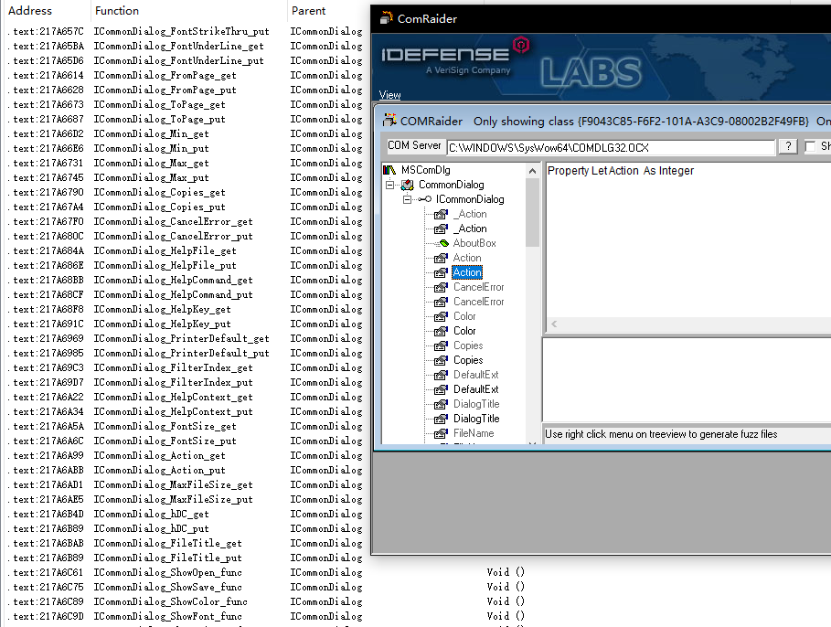

# COMFinder

## IDA plugin for COM

### 这是一个IDA的插件，依赖于IDAPython，用于查找标记COM组件中函数

## 效果图

左侧为IDA中效果，右侧对比了ComRaider

## 原理

1. 在IDAPython中通过pywin32的pythoncom获取COM组件中的原型

1. 使用独立的程序获取COM组件中原型对应的虚表

    **特别注意：由于需要加载dll之后获取虚表，所以千万不要用于恶意程序分析**

## 安装

1. 安装IDA的时候，要勾选IDAPython

1. 安装pywin32`pip install pywin32`

1. 将bin目录三个文件复制到插件目录

    默认情况下，在这个目录：`C:\Program Files\IDA 7.6\plugins`

1. 删除或备份插件目录原始的`comhelper.dll`和`comhelper64.dll`文件

## 更新记录

1. 2022-9-30
   
   1. 支持IDA7.6,支持Python3
   
1. 2020-4-8

    1. 重新编译去除运行库依赖，解决丢失MSVCR90.dll等问题

    1. 增加说明，解决IDA自带comhelper导致本插件无法使用的问题